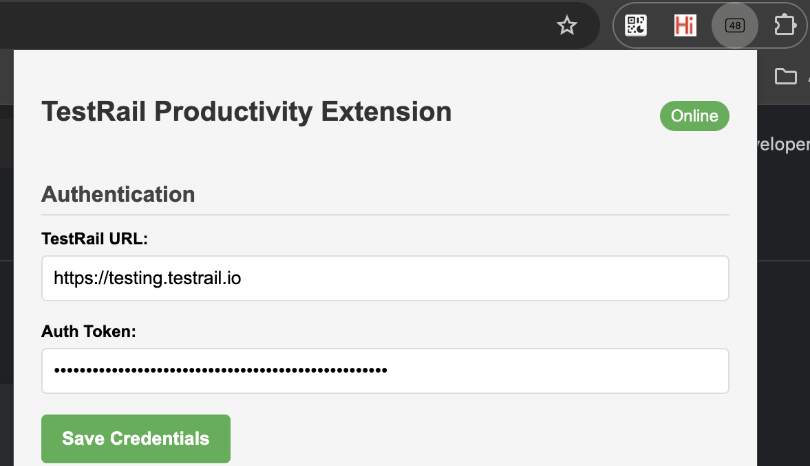
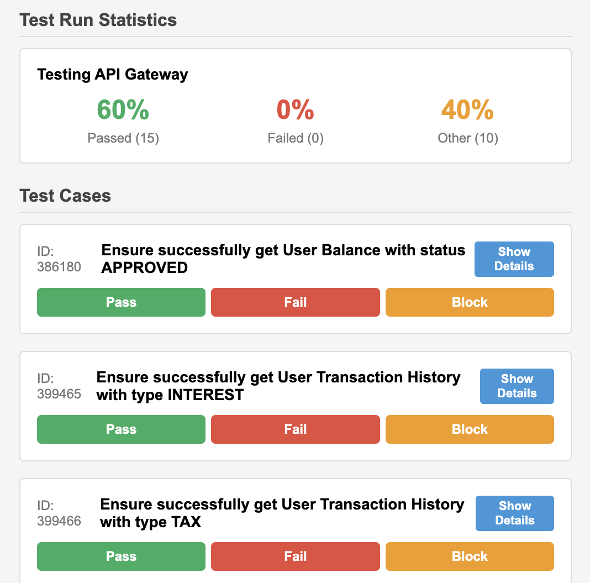
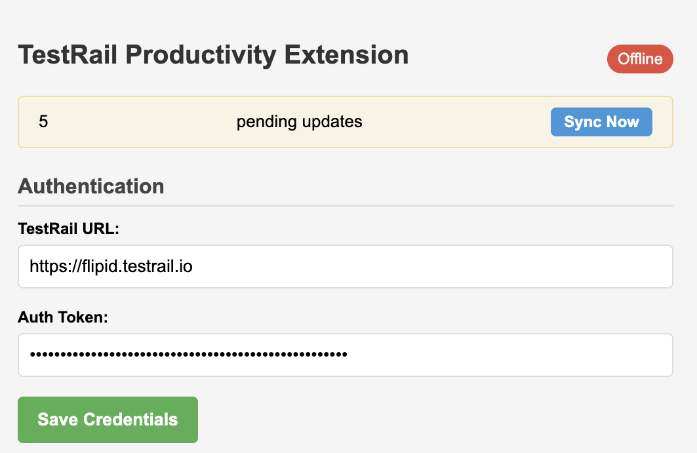
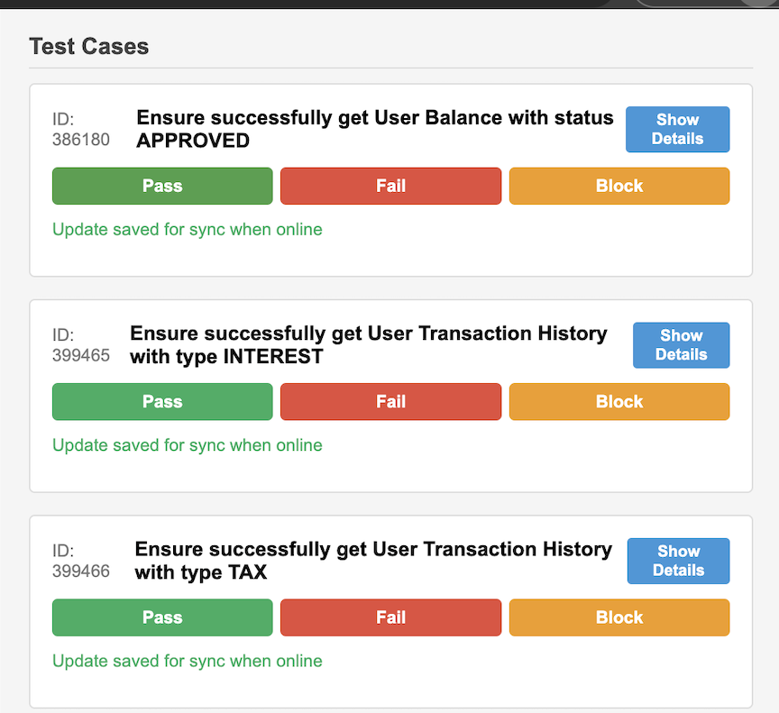

# TestRail Extension
This Chrome extension helps you manage your TestRail test cases and test runs directly from your browser. It allows you to view test run statistics, fetch test cases, and update test case statuses even when offline.

## Features
- Connect to your TestRail instance using API authentication
- View test run statistics with pass/fail percentages
- Fetch and display test cases from a specific test run
- Update test case statuses (pass, fail, blocked, etc.)
- Offline support with automatic synchronization when back online
- Secure credential storage

## Installation
1. Download or clone this repository
2. Open Chrome and navigate to chrome://extensions/
3. Enable "Developer mode" in the top right corner
4. Click "Load unpacked" and select the extension directory
5. The TestRail Extension icon should now appear in your browser toolbar

## Usage
1. Click on the extension icon to open the popup
2. Enter your TestRail URL and API authentication token
3. Click "Save Credentials" to store your authentication details
4. Enter a Test Run ID and click "Fetch Test Cases"
5. View test run statistics and test cases
6. Update test case statuses by clicking the appropriate buttons

## Screenshots

*Caption: Authentication Screen*

*Caption: Test run statistics showing pass/fail percentages*

## Offline Support
The extension works offline and will store any status updates you make while disconnected. When you're back online, it will automatically synchronize the pending updates with TestRail.

*Caption: Authentication Screen*

*Caption: Test run statistics showing pass/fail percentages*

## Security
Your TestRail credentials are stored securely in Chrome's local storage and are only used for API requests to your TestRail instance.

## Contributing
Contributions are welcome! Please feel free to submit a Pull Request.

## License
This project is licensed under the MIT License - see the LICENSE file for details.